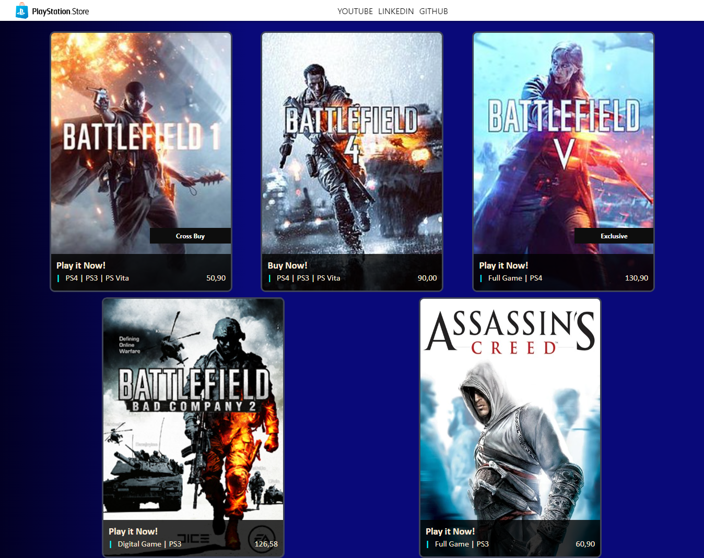

# PlayStation Store Clone

Este projeto foi gerado com a versão 15.2.4 do [Angular CLI](https://github.com/angular/angular-cli).

## Sobre o projeto

A aplicação é um clone do template exibido pelo educador Felipe Aguiar, recriando a interface da PlayStation Store utilizando Angular.

## Servidor de desenvolvimento

Execute `ng serve` para usar o servidor de desenvolvimento e navegue até `http://localhost:4200/`. A aplicação será recarregada automaticamente se você alterar qualquer um dos arquivos fonte.

## Mais ajuda

Para obter mais ajuda sobre a CLI do Angular, use `ng help` ou confira a página [Angular CLI Overview and Command Reference](https://angular.io/cli).
